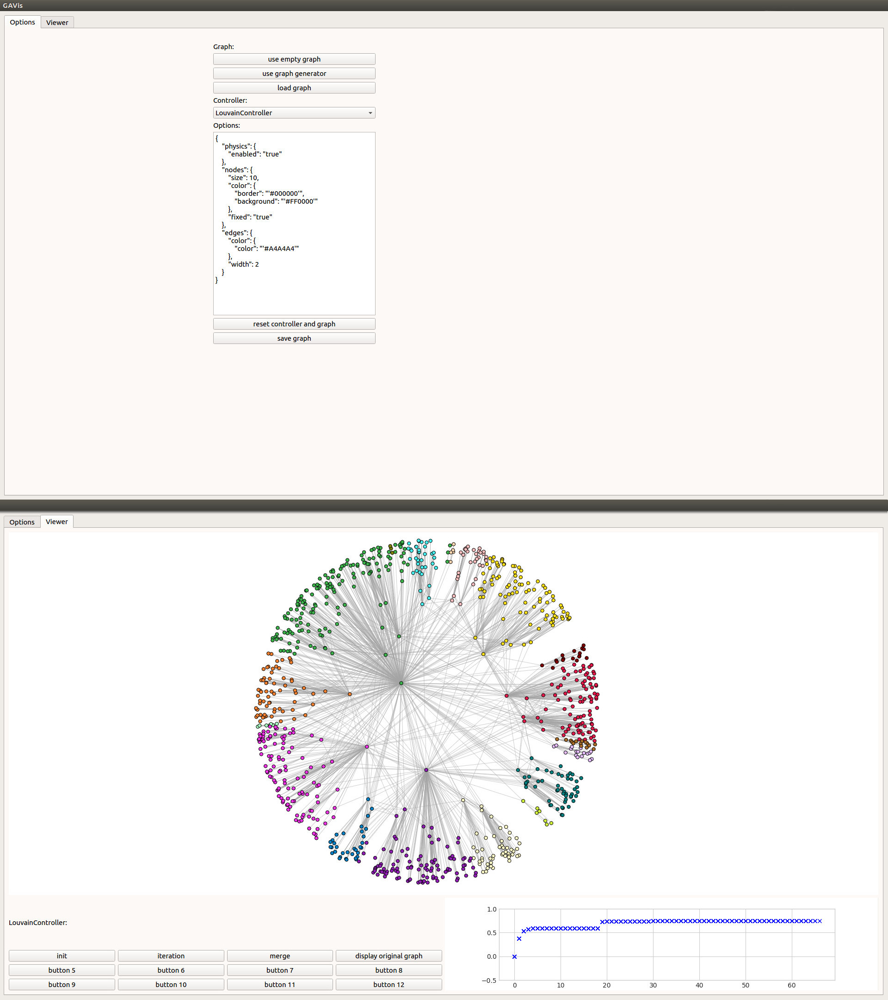

# GAVis - Graph Algorithm Visualizer



## Summary

This tool's intend is to visualize graph algorithms.

Graph models so far:
- Random Geometric Graph
- Hyperbolic Random Graph
- Chung-Lu
- Erdős-Rényi

Algorithms so far:
- Louvain Modularity Maximization

## Requirements

### Vis.js

http://visjs.org/

Vis has to be in the folder gavis/vis/node_modules/vis/

```
cd gavis/vis
npm install vis
```

## Vis.js Options

For more details on the options in the Options-Tab see http://visjs.org/docs/network/.